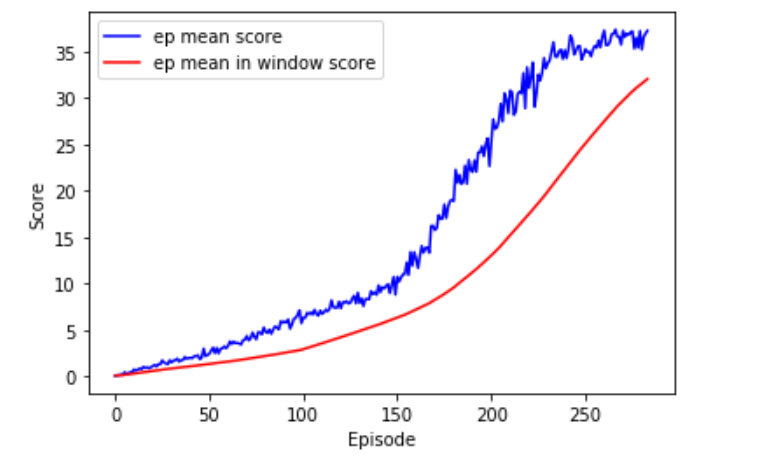

# Raport: Continuous Control

## Algorithm

Agent solving environment is trained with Proximal Policy Optimization Algorithm (PPO - [more about algorithm](https://arxiv.org/pdf/1707.06347.pdf)). Implementation used in project is almost complitly based on code from [this repository](https://github.com/reinforcement-learning-kr/pg_travel) with only few adjustments.

Citing authors of PPO: "We propose a new family of policy gradient methods for reinforcement learning, which alternate between sampling data through interaction with the environment, and optimizing a “surrogate” objective function using stochastic gradient ascent. (...)  Our experiments test PPO on a collection of benchmark tasks, including simulated robotic locomotion and Atari game playing, and we show that PPO outperforms other online policy gradient methods, and overall strikes a favorable balance between sample complexity, simplicity, and wall-time" ([source](https://arxiv.org/pdf/1707.06347.pdf)).

Motivation to use PPO was good performance despite being simpler than similar methods. Citing [OpenAI](https://openai.com/blog/openai-baselines-ppo/):
"Researchers have sought to eliminate these flaws with approaches like TRPO and ACER, by constraining or otherwise optimizing the size of a policy update. These methods have their own trade-offs — ACER is far more complicated than PPO, requiring the addition of code for off-policy corrections and a replay buffer, while only doing marginally better than PPO on the Atari benchmark; TRPO — though useful for continuous control tasks — isn’t easily compatible with algorithms that share parameters between a policy and value function or auxiliary losses, like those used to solve problems in Atari and other domains where the visual input is significant."

## Envirment

In this environment, a double-jointed arm can move to target locations. A reward of +0.1 is provided for each step that the agent's hand is in the goal location. Thus, the goal of your agent is to maintain its position at the target location for as many time steps as possible.

The observation space consists of 33 variables corresponding to position, rotation, velocity, and angular velocities of the arm. Each action is a vector with four numbers, corresponding to torque applicable to two joints. Every entry in the action vector should be a number between -1 and 1.

The barrier for solving the second version of the environment is slightly different, to take into account the presence of many agents. In particular, agents must get an average score of +30 (over 100 consecutive episodes, and over all agents).

Despite that in 'Continuous_Control.ipynb' stop critetion for training is set to mean score:  +32.0 for all agents in 100 episodes window.

## Agent

Agent is implemented as two separate neural networks: actor and critic - code for both of them is in folder 'Code' in file: 'my_model.py'. 

### Network architecture:

Actor:
- 33 inputs (as observation space), 4 outputs (as action vector)
- 3 fully connected layers with: 256 -> 64 -> 4 neurons in each
- Elu activations except last linear layer

Critic:
- 33 inputs (as observation space), 1 output 
- 3 fully connected layers with: 256 -> 64 -> 1 neurons in each
- Elu activations except last linear layer

## Hyperparameters

Hyperparameters are set up in blank class artificial_args in variable 'args' inside 'Continuous_Control.ipynb' - that variable is serialized for reproducibility (also because original implementation of PPO used was using command args havily). Many hyperparameters are set to same values as in repository with [PPO implementation repository](https://github.com/reinforcement-learning-kr/pg_travel). 

Agent and optimizers parameters:
- args.actor_lr = 0.0005
- args.critic_lr = 0.0005
- args.l2_rate = 0.0001
- args.gamma = 0.995
- args.lamda = 0.95
- args.clip_param = 0.1
- args.batch_size = 2048
- args.input_size = 33
- args.output_size = 4
- args.hidden_size = 256
- args.activation = "elu"

Traning process parameters:
- args.agent_number = 20
- args.device = 'cpu'
- args.episodes = 2000
- args.scores_window_len = 100

## Training process

Learning proces took 284 episodes - mean score is shown in the chart above. Final agent weights were saved as 'final_model.pth' and can be loaded using 'load_networks' method in 'Continuous_Control.ipynb'. As can be seen on chart score incresed faster after 150 episodes it's probaly due to too big initial learning rate (It's also possible because scores fluctuate havily - mean score is ragged in each episode (blue line on chart)). Learning was stoped after mean score:  +32.0 for all agents in 100 episodes window (red line above +32.0).

## Agent behaviour

Before traning - random moves (exploration):

After training - following sphere:

## Future improvement ideas

- Comparation between different algorithms (like TRPO or DDPG) on both version of environment single and multi agents could lead to gaining insight and experience. Proper way to do this for many environments is in [paper](https://arxiv.org/pdf/1604.06778.pdf).
- Implementing systematic Hyperparameter Tuning is necessary to build intution about 
influence of hyperparameters on the training process - Right way to do this is probably use one of: Random Search or Bayesian Optimization ([good post about second technique](https://distill.pub/2020/bayesian-optimization/)) but such approach require GPU for sure!
- Combining the current implementation of PPO with patterns with the frequently mentioned in course implementation: Shangtong Zhang ([here](https://github.com/ShangtongZhang/DeepRL)) could help develop programmatically.

## References

- [1] https://arxiv.org/pdf/1707.06347.pdf
- [2] https://openai.com/blog/openai-baselines-ppo/
- [3] https://github.com/reinforcement-learning-kr/pg_travel
- [4] https://arxiv.org/pdf/1604.06778.pdf
- [5] https://distill.pub/2020/bayesian-optimization/
- [6] https://github.com/ShangtongZhang/DeepRL