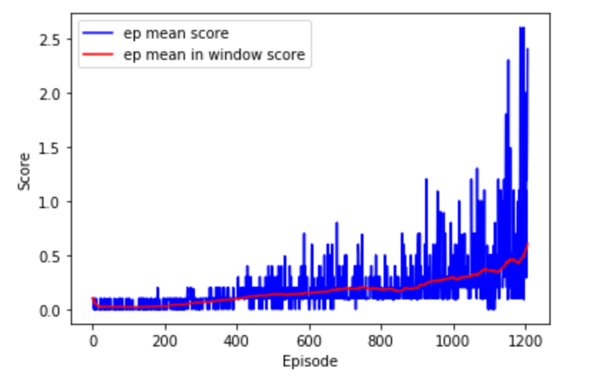
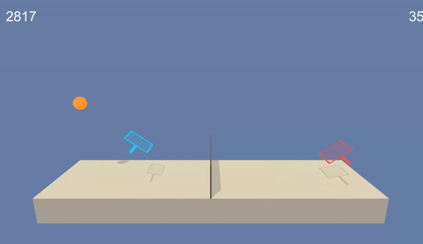
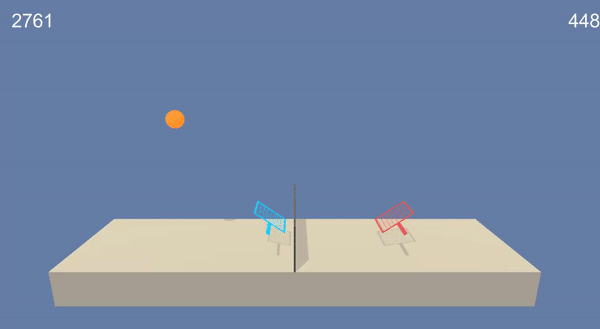

# Raport: Collaboration and Competition

## Algorithm

Agent solving environment is trained with Soft Actor-Critic Algorithm (SAC - [more about algorithm](https://arxiv.org/abs/1801.01290)). Implementation used in project is almost completely based on code from [this repository](https://github.com/higgsfield/RL-Adventure-2) with only few adjustments.

TODO - przerobić całe poniżej:

Citing authors of PPO: "We propose a new family of policy gradient methods for reinforcement learning, which alternate between sampling data through interaction with the environment, and optimizing a “surrogate” objective function using stochastic gradient ascent. (...)  Our experiments test PPO on a collection of benchmark tasks, including simulated robotic locomotion and Atari game playing, and we show that PPO outperforms other online policy gradient methods, and overall strikes a favorable balance between sample complexity, simplicity, and wall-time" ([source](https://arxiv.org/pdf/1707.06347.pdf)).

Motivation to use PPO was good performance despite being simpler than similar methods. Citing [OpenAI](https://openai.com/blog/openai-baselines-ppo/):
"Researchers have sought to eliminate these flaws with approaches like TRPO and ACER, by constraining or otherwise optimizing the size of a policy update. These methods have their own trade-offs — ACER is far more complicated than PPO, requiring the addition of code for off-policy corrections and a replay buffer, while only doing marginally better than PPO on the Atari benchmark; TRPO — though useful for continuous control tasks — isn’t easily compatible with algorithms that share parameters between a policy and value function or auxiliary losses, like those used to solve problems in Atari and other domains where the visual input is significant."

## Envirment

In this environment, two agents control rackets to bounce a ball over a net. If an agent hits the ball over the net, it receives a reward of +0.1. If an agent lets a ball hit the ground or hits the ball out of bounds, it receives a reward of -0.01. Thus, the goal of each agent is to keep the ball in play.

The observation space consists of 8 variables corresponding to the position and velocity of the ball and racket. Each agent receives its own, local observation. Two continuous actions are available, corresponding to movement toward (or away from) the net, and jumping.

The task is episodic, and in order to solve the environment, your agents must get an average score of +0.5 (over 100 consecutive episodes, after taking the maximum over both agents). Specifically, after each episode, we add up the rewards that each agent received (without discounting), to get a score for each agent. This yields 2 (potentially different) scores. We then take the maximum of these 2 scores - this yields a single score for each episode.

The environment is considered solved, when the average (over 100 episodes) of those scores is at least +0.5.

## Agent

TODO - przerobić całe to, dodać poprawne parametry

Agent is implemented as two separate neural networks: actor and critic - code for both of them is in folder 'Code' in file: 'my_model.py'. 

### Network architecture:

Actor:
- 33 inputs (as observation space), 4 outputs (as action vector)
- 3 fully connected layers with: 256 -> 64 -> 4 neurons in each
- Elu activations except last linear layer

Critic:
- 33 inputs (as observation space), 1 output 
- 3 fully connected layers with: 256 -> 64 -> 1 neurons in each
- Elu activations except last linear layer

## Hyperparameters

Hyperparameters are set up in blank class artificial_args in variable 'args' inside 'Continuous_Control.ipynb' - that variable is serialized for reproducibility (also because original implementation of PPO used was using command args havily). Many hyperparameters are set to same values as in repository with [PPO implementation repository](https://github.com/reinforcement-learning-kr/pg_travel). 

Agent and optimizers parameters:
- args.actor_lr = 0.0005
- args.critic_lr = 0.0005
- args.l2_rate = 0.0001
- args.gamma = 0.995
- args.lamda = 0.95
- args.clip_param = 0.1
- args.batch_size = 2048
- args.input_size = 33
- args.output_size = 4
- args.hidden_size = 256
- args.activation = "elu"

Traning process parameters:
- args.agent_number = 20
- args.device = 'cpu'
- args.episodes = 2000
- args.scores_window_len = 100

## Training process

Learning process took 1208 episodes — blue curve shows score in each of the episode while mean score is shown as red curve in the chart above. Final agent weights were saved as 'final_agent.pth' in 'tennis.ipynb'. Learning was stopped after reaching mean score in 100 episode window of +0.6 (it took 1208 episodes) — while official Udacity requirement for solving the environment is +0.5 mean score in 100 episode window, which was achieved in 1198 episodes.

## Agent behaviour

Before traning - random moves (exploration) with a bit of luck at the end:

After training - keeping ball in play:

## Future improvement ideas

- [TODO ZMIENIĆ TO NA HRE + DDGP] Comparation between different algorithms (like TRPO or DDPG) on both version of environment single and multi agents could lead to gaining insight and experience. Proper way to do this for many environments is in [paper](https://arxiv.org/pdf/1604.06778.pdf).
- Implementing systematic Hyperparameter Tuning is necessary to build intution about 
influence of hyperparameters on the training process - Right way to do this is probably use one of: Random Search or Bayesian Optimization ([good post about second technique](https://distill.pub/2020/bayesian-optimization/)) but such approach require GPU for sure!
- Combining the current implementation of PPO with patterns with the frequently mentioned in course implementation: Shangtong Zhang ([here](https://github.com/ShangtongZhang/DeepRL)) could help develop programmatically.

## References

- [1] https://arxiv.org/abs/1801.01290
- [2] https://github.com/higgsfield/RL-Adventure-2

- [3] https://github.com/reinforcement-learning-kr/pg_travel
- [4] https://arxiv.org/pdf/1604.06778.pdf
- [5] https://distill.pub/2020/bayesian-optimization/
- [6] https://github.com/ShangtongZhang/DeepRL