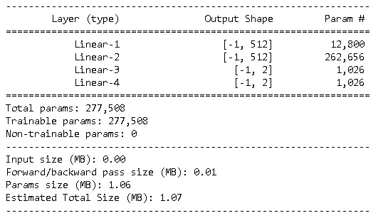

# Raport: Collaboration and Competition

## Algorithm

Agent solving environment is trained with Soft Actor-Critic Algorithm (or SAC for short - [more about algorithm](https://arxiv.org/abs/1801.01290)). Implementation used in project is almost completely based on code from [this repository](https://github.com/higgsfield/RL-Adventure-2) with only few adjustments.

Citing authors of SAC from paper linked above: "Model-free deep reinforcement learning (RL) algorithms have been demonstrated on a range of challenging decision making and control tasks. However, these methods typically suffer from two major challenges: very high sample complexity and brittle convergence properties, which necessitate meticulous hyperparameter tuning. Both of these challenges severely limit the applicability of such methods to complex, real-world domains. In this paper, we propose soft actor-critic, an offpolicy actor-critic deep RL algorithm based on the maximum entropy reinforcement learning framework. In this framework, the actor aims to maximize expected reward while also maximizing entropy. That is, to succeed at the task while acting as randomly as possible. Prior deep RL methods based on this framework have been formulated as Q-learning methods. By combining off-policy updates with a stable stochastic actor-critic formulation, our method achieves state-of-the-art performance on a range of continuous control benchmark tasks, outperforming prior on-policy and off-policy methods. Furthermore, we demonstrate that, in contrast to other off-policy algorithms, our approach is very stable, achieving very similar performance across different random seeds."

Motivation to use SAC was good performance combined with stability and will to use a different algorithm than the one discussed during lessons: Multi-Agent Deep Deterministic Policy Gradient ([MADDPG paper](https://arxiv.org/pdf/1706.02275.pdf)).

## Environment

In this environment, two agents control rackets to bounce a ball over a net. If an agent hits the ball over the net, it receives a reward of +0.1. If an agent lets a ball hit the ground or hits the ball out of bounds, it receives a reward of -0.01. Thus, the goal of each agent is to keep the ball in play.

The observation space consists of 8 variables corresponding to the position and velocity of the ball and racket. Each agent receives its own, local observation. Two continuous actions are available, corresponding to movement toward (or away from) the net, and jumping.

The task is episodic, and in order to solve the environment, your agents must get an average score of +0.5 (over 100 consecutive episodes, after taking the maximum over both agents). Specifically, after each episode, we add up the rewards that each agent received (without discounting), to get a score for each agent. This yields 2 (potentially different) scores. We then take the maximum of these 2 scores - this yields a single score for each episode.

The environment is considered solved, when the average (over 100 episodes) of those scores is at least +0.5.

## Agent

Agent is implemented as three separate neural networks: Value Network (with target copy), SoftQNetwork and PolicyNetwork.

### Network architecture:

Value Network:

- 24 inputs (as observation space), 1 output
- 3 fully connected linear layers with: 512 -> 512 -> 1 neurons in each layer
- Value network got it's target copy (dequpling the target from the parameters leads to more stable and less likely to diverge or fall into oscillations learning process)

SoftQNetwork:

- 26 inputs (as observation space + actions space), 1 output
- 3 fully connected linear layers with: 512 -> 512 -> 1 neurons in each layer

PolicyNetwork:

- 24 inputs (as observation space), 2 output
- 2 fully connected layers with: 512 -> 512  neurons in each layer and then 
two parallel layers one for computing mean and second for computing log_std - each has number same as number of actions: 2

## Hyperparameters

Most of hyperparameters are set to same values as in [SAC implementation repository](https://github.com/higgsfield/RL-Adventure-2/blob/master/7.soft%20actor-critic.ipynb). 

ReplayBuffer:
- capacity = 100000
- sample_batch_size = 1024

Opimizers learning rates and params:
- value_lr  = 3e-4
- soft_q_lr = 3e-4
- policy_lr = 3e-4
- optimizers_type = Adam
- value_criterion  = nn.MSELoss()
- soft_q_criterion = nn.MSELoss()

Learning step of SAC params:
- gamma=0.99
- mean_lambda=1e-3
- std_lambda=1e-3
- z_lambda=0.0
- soft_tau=1e-2

Lerning episodes params:
- max_episodes=20000
- learning_stop_criterion = 0.6
- scores_window_len = 100

Neural networks init params:

- number_of_hidden_layer_neurons = 512
- init_weight_distribution = uniform
- init_w=3e-3
- log_std_min=-20
- log_std_max=2
- default_epsilon=1e-6

## Training process

Learning process took 1208 episodes — blue curve shows score in each of the episode while mean score is shown as red curve in the chart above. Final agent weights were saved as 'final_agent.pth' in 'tennis.ipynb' (that file could be found in "Checkpoints" folder). Learning was stopped after reaching mean score in 100 episode window of +0.6 (it took 1208 episodes) — while official Udacity requirement for solving the environment is +0.5 mean score in 100 episode window, which was achieved in 1198 episodes.

## Agent behaviour

Before traning - random moves (exploration) with a bit of luck at the end:

After training - keeping ball in play:

## Future improvement ideas

- It would be very beneficial to compare achived result with SAC to result achived with other algorithms, one of possible competitive approach is fore sure: Hindsight Experience Replay (HER - [paper](https://arxiv.org/abs/1707.01495)) - a reinforcement learning algorithm that can learn from failure, that is especially good in problems with sparse rewads (isn't it simmilar to tennis?). HER can also be combined with any off-policy RL algorithm so next candidate to compere is HER can be combined with MADDPG. Such comparation should be messures in simillar way as comparation between different algorithms in [paper](https://arxiv.org/pdf/1604.06778.pdf).
- Implementing systematic Hyperparameter Tuning is necessary to build intution about 
influence of hyperparameters on the training process - Right way to do this is probably use one of: Random Search or Bayesian Optimization ([good post about second technique](https://distill.pub/2020/bayesian-optimization/)) but such approach require GPU for sure and presented result was achived by using local CPU power.
- Combining the design patterns used by Zhang in [his repository](https://github.com/ShangtongZhang/DeepRL) which was often mentioned during the course, would help both with code readability and personal development as a programmer for author of this repository.

## References

- [1] https://arxiv.org/abs/1801.01290
- [2] https://github.com/higgsfield/RL-Adventure-2
- [3] https://arxiv.org/pdf/1706.02275.pdf
- [4] https://arxiv.org/abs/1707.01495
- [5] https://arxiv.org/pdf/1604.06778.pdf
- [6] https://distill.pub/2020/bayesian-optimization/
- [7] https://github.com/ShangtongZhang/DeepRL