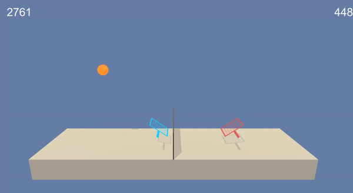

# DRLND Project 3: Collaboration and Competition

## Introduction

Presented repository contains all three projects needed to finish Deep Reinforcement Learning Nanodegree Program - [more about program here](https://www.udacity.com/course/deep-reinforcement-learning-nanodegree--nd893). 

All programs/projects templates that are part of above nanodegree could be found in offical repository: [here](https://github.com/udacity/deep-reinforcement-learning) (that includes not only project starting tampletes but also solved code for each lesson).

Short description of each project is provided below. A detailed description with a code to reproduce the result can be found in separate folder for each project - numbered as below.

## Project 1: Value-Based Methods

After mastering the fundamentals of reinforcement learning by writing own implementations of many classical solution methods - it's time to apply deep learning architectures to reinforcement learning tasks. First project use neural networks to train an agent to navigate a virtual world and collect as many yellow bananas as possible while avoiding blue bananas.

## Project 2: Policy-Based Methods

After learning the theory behind evolutionary algorithms and policy-gradient methods in second project task is to design own algorithm to train a simulated robotic arm to reach target locations (green sphere) - used enviroment provides 20 arms and spheres pairs at the same time.

## Project 3: Multi-Agent Reinforcement Learning

After learning how to apply reinforcement learning methods to applications that involve multiple, interacting agents (such techniques are used in a variety of applications - for example in the coordination of autonomous vehicles). In third project agents are trained to play tennis while cooperate to keep ball in play as long as possible.

## References

- [1] https://www.udacity.com/course/deep-reinforcement-learning-nanodegree--nd893
- [2] https://github.com/udacity/deep-reinforcement-learning
